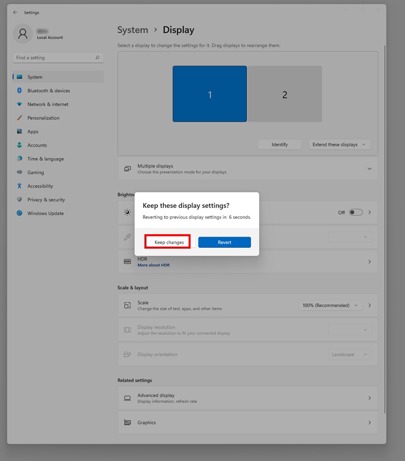

# Bước 1: Setup
    
## 1. Máy chiếu: 
        1.1. Bố trí: đặt máy chiếu cố định, chiếu sàn. Kết nối máy máy chiếu với máy tính (cổng HDMI hoặc VGA). 
        1.2. Cài đặt: đặt máy chiếu là màn hình phụ (số 2) độ phân giải máy chiếu là (w2, h2), kế bên màn hình chính (số 1) độ phân giải màn chính là (w1, h1). Như vậy tọa độ của điểm (x, y) trên màn chiếu sẽ là (w1 + x, y) khi chọn chế độ hiển thị là Extend (màn 2 là extend của màn hình 1, và đặt kế tiếp phía bên phải như hình ảnh) lưu ý chọn hiển thị scale là 100%
    <hr>


    <hr>
        Chọn flipped landscape cho chế độ hiển thị của máy chiếu, mục đích để phần đáy màn hình ở phía xa của máy chiếu (phía xa của lidar)

## 2. Cảm biến Lidar:
        2.1. Đặt cảm biến lật úp để phần quét gần với sàn hơn. Đặt cố định Lidar, để góc 0 độ hướng ra ngoài.

## 3. Đo các khoảng cách:
        Đối với máy chiếu không tự điều chỉnh được kích thước hình chiếu thành hình chữ nhật, thì hình chiếu lên sàn sẽ là dạng hình thang hoặc hình tứ giác lồi. Ta cố gắng chỉnh sao cho có được dạng hình thang. Khi đó, cạnh ngắn của hình chiếu ở phía gần máy chiếu và cạnh dài ở phía xa máy chiếu hơn. Cần đo các khoảng cách sau:
        - Chiều dài cạnh ngắn (gần) và cạnh dài (xa)
        - khoảng cách từ cạnh ngắn đến cạnh dài.
        Chú ý đặt Lidar sao cho góc 0 độ vuông góc với các cạnh đáy của hình thang, khoảng cách từ lidar đến cạnh gần nhất >= 50cm, và góc nhìn từ Lidar đến hình thang là lớn nhất. Như vậy, ta chọn đặt Lidar cách cạnh gần của hình thang là 50cm, Lidar nằm trên đường trung trực của cạnh này

# Bước 2: Tính toán tọa độ
    Tính toán tọa độ của hình thang (theo mm), với tâm tọa độ là tâm O của Lidar, trục Oy là trung trực của cạnh đáy hình thang
    Nếu Lidar đặt ngửa thì chiều quay của Lidar là theo chiều kim đồng hồ (ngược chiều dương), nếu lật úp Lidar thì chiều quay là ngược chiều kim đồng hồ (là chiều dương).
    Tính tọa độ các điểm của hình thang ABCD

# Bước 3: Nhập tọa độ ABCD vào phần mềm


```python
    A = (580, 500)
    B = (710, 1450)
    C = (-710, 1450)
    D = (-580, 500)
    quad_cartesian_points = [A, B, C, D]
```
End.
